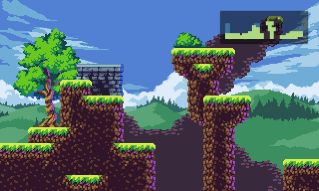

# Tilemap Minimap
An example Godot project demonstrating how to use tilemaps to render a minimap.

Uses the excellent [Free Pixelart Tileset - Cute Forest](https://aamatniekss.itch.io/free-pixelart-tileset-cute-forest) by [aamatniekss](https://aamatniekss.itch.io/).

See it [running in your browser over on itch](https://akimbo.itch.io/godot-tilemap-minimap).
